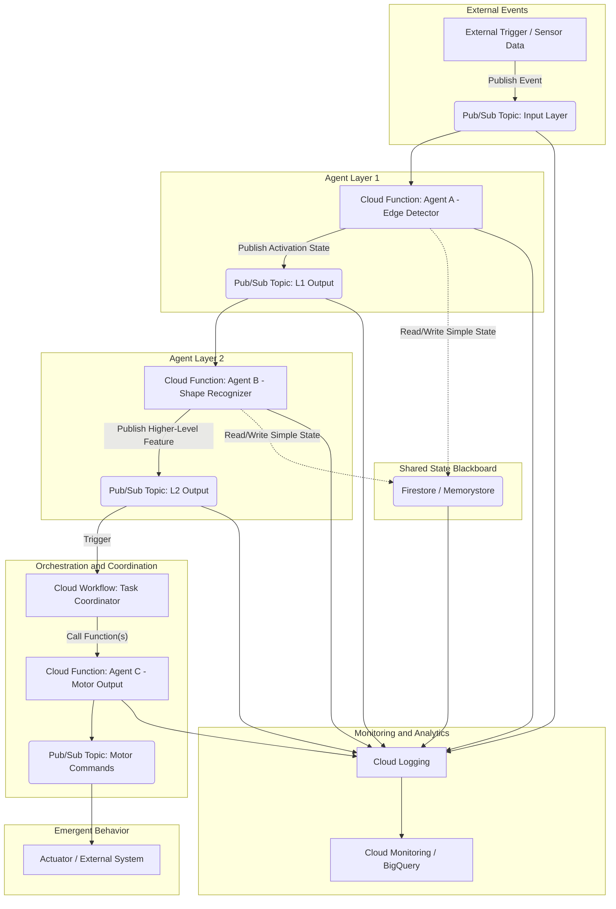

```mermaid
graph TD
    subgraph External Events
        A[External Trigger / Sensor Data] -->|Publish Event| B(Pub/Sub Topic: Input Layer)
    end

    subgraph Agent Layer 1
        B --> C[Cloud Function: Agent A - Edge Detector]
        C -->|Publish Activation State| D(Pub/Sub Topic: L1 Output)
    end

    subgraph Agent Layer 2
        D --> E[Cloud Function: Agent B - Shape Recognizer]
        E -->|Publish Higher-Level Feature| F(Pub/Sub Topic: L2 Output)
    end

    subgraph Shared State Blackboard
        C -.->|Read/Write Simple State| G(Firestore / Memorystore)
        E -.->|Read/Write Simple State| G
    end

    subgraph Orchestration and Coordination
        F -- Trigger --> H[Cloud Workflow: Task Coordinator]
        H -- Call Function(s) --> I[Cloud Function: Agent C - Motor Output]
        I --> J(Pub/Sub Topic: Motor Commands)
    end

    subgraph Monitoring and Analytics
        C --> K[Cloud Logging]
        E --> K
        I --> K
        G --> K
        D --> K
        F --> K
        B --> K
        K --> L[Cloud Monitoring / BigQuery]
    end

    subgraph Emergent Behavior
        J --> Z[Actuator / External System]
    end
```
